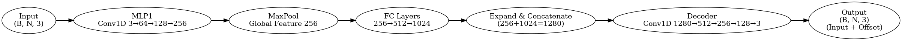
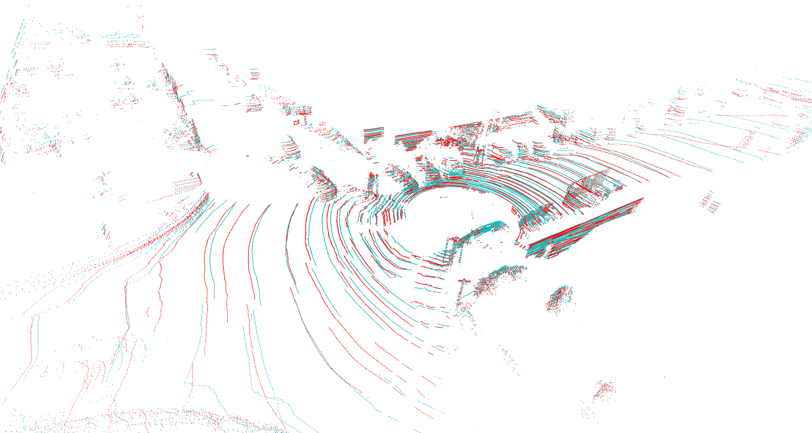

# PointInterp - Lightweight LiDAR Point Cloud Super-Resolution Framework

PointInterp is a lightweight and efficient non-2D-projection solution for LiDAR point cloud super-resolution. Through interpolation methods and a PointNet-based neural network model, it enhances sparse scan lines in point clouds, such as upgrading from 16 lines to 32 lines or from 32 lines to 64 lines, significantly improving point cloud resolution and detail.  

[繁體中文版本](README_zh.md)

## Project Overview
This project provides the following main functionalities:

* **Data Conversion Pipeline**: Converts raw KITTI `.bin` point clouds into structured HDF5 format.
* **Traditional Interpolation Methods**: Provides stable interpolation baselines for comparison.
* **PointNet-SR-Mini Neural Network**: A lightweight network specifically designed for point cloud super-resolution.
* **Chamfer Distance Calculation Tools**: For evaluating the accuracy of point cloud predictions.
* **Quantitative Analysis and Visualization Scripts**: Assists in analyzing point cloud processing results.

## Key Features
* **Multi-Scan Line HDF5 Converter** (`dataset_to_h5.py`): Splits 64-line original point clouds into 32-line and 16-line versions, saving them as HDF5 files.
* **Chamfer Distance Implementation**: Provides both NumPy and KD-Tree efficient calculation methods (`metrics.py`).
* **Interpolation Baseline Method**: Provides bi-directional interpolation based on angle and azimuth (`interpolation.py`).
* **PointNet-SR-Mini Model** (`pointnet_sr_mini.py`):

  * Supports 16→32 and 32→64 scan line enhancement.
  * Can resume training from checkpoints, with built-in EarlyStopping and learning rate adjustment mechanisms.
* **Analysis Scripts** (`analyze.py`, `main.py`):

  * Quantitatively evaluates the effectiveness of interpolation and neural network predictions.
  * Provides real-time visualization comparison for single-frame point clouds.

## Main Algorithm Logic

This project proposes a "difference set-point completion" super-resolution algorithm for sparse LiDAR scan lines, with a workflow divided into interpolation baseline and deep enhancement layers.

**1. Interpolation Baseline**  
First, divide the N-line point cloud into bins based on elevation angle $\theta=\arcsin\frac{z}{r}$; for adjacent rings, use KD-Tree to pair and insert midpoints:

$$
p_{\text{mid}}=\tfrac12(p_i+p_j)
$$

Then, evenly supplement at azimuth angle $\varphi \in (0, 2\pi)$ with $\Delta\varphi = 0.5^\circ$ to ensure the final number of rings precisely equals the target $R_t$. This step can independently serve as a traditional baseline.

**2. Difference Set Extraction**  
For the original low-resolution point cloud $P_{orig}$ and high-resolution point cloud $P_{tgt}$, compute:

$$
\Delta P=\{\,t\in P_{\text{tgt}}\mid\min_{o\in P_{\text{orig}}}\|t-o\|>\tau\}
$$

$(\tau \approx 0.05\,\mathrm{m})$ as the set of points to be completed.

**3. PointNet-SR-Mini**  
For $\Delta P (B \times N \times 3)$, first extract features $f_i \in \mathbb{R}^{256}$ using $1 \times 1$ convolution, then obtain a global vector $g \in \mathbb{R}^{256}$ through max-pooling. After concatenation, output the offset $o$, and finally:

$$
P_{\text{pred}}=\Delta P+o
$$

**4. Loss Function**  
Adopts squared Chamfer distance:

$$
\mathrm{CD}(P,G)=\frac{1}{|G|} \sum_{g \in G} \min_{p \in P} \|g-p\|^2 + \frac{1}{|P|} \sum_{p \in P} \min_{g \in G} \|p-g\|^2
$$

where G is the ground truth high-resolution point cloud. Adam optimizer is used; ReduceLROnPlateau dynamically reduces learning rate combined with Early-Stopping.

**5. Deep Learning Model**  

```plaintext
Input (B, N, 3)
      ↓
MLP1 (Conv1D 3→64→128→256)
      ↓
MaxPool (Global Feature 256)
      ↓
FC Layers (256→512→1024)
      ↓
Expand & Concatenate (256+1024=1280)
      ↓
Decoder (Conv1D 1280→512→256→128→3)
      ↓
Output: Predicted Offsets + Input
```



**6. Results**
On the KITTI dataset, the 16→32 line average CD improves by about 10% compared to interpolation, while the 32→64 line improves by over 60%. Real-time inference is possible on an RTX 3080. The algorithm is lightweight and easy to train, and can also be replaced with deeper models such as PointNet++, PU-Net, etc. for further quality improvement.

The figure below shows the error visualization result for a random frame from the KITTI Dataset, where cyan represents the Ground Truth, and red represents the difference set between the inference result and GT:


## Project Structure
```plaintext
.
├── dataset_to_h5.py        # Converts KITTI original .bin files to HDF5 format (16/32/64 scan lines)
├── io.py                   # HDF5 point cloud data loading tools
├── metrics.py              # Chamfer Distance and difference set calculation tools
├── interpolation.py        # Point cloud interpolation tools
├── pointnet_sr_mini.py     # PointNet-SR-Mini model definition and training
├── analyze.py              # Interpolation baseline analysis script
├── main.py                 # Single-frame point cloud inference and Open3D visualization script
├── dataset/                # Storage for training and testing HDF5 data
├── ckpt_srmini/            # Model checkpoint storage folder
└── figures/                # Chamfer Distance analysis curve charts
```

## Dataset Structure
``` plaintext
/train.h5
 ├── 16/    (16-line point clouds)
 │    ├── 2011_09_26_0001_0000000000  → (N, 4)  (includes x, y, z, intensity)
 │    ├── 2011_09_26_0001_0000000001  → (M, 4)
 │    └── ...(more frames)
 │
 ├── 32/    (32-line point clouds)
 │    ├── 2011_09_26_0001_0000000000  → (N, 4)
 │    ├── 2011_09_26_0001_0000000001  → (M, 4)
 │    └── ...(more frames)
 │
 └── 64/    (64-line point clouds, Ground Truth)
      ├── 2011_09_26_0001_0000000000  → (N, 4)
      ├── 2011_09_26_0001_0000000001  → (M, 4)
      └── ...(more frames)

```

## Software Dependencies
This project is compatible with Python 3.8+ and requires the following third-party packages:

* [PyTorch](https://pytorch.org/)
* [Open3D](http://www.open3d.org/)
* [SciPy](https://www.scipy.org/)
* [h5py](https://www.h5py.org/)
* [tqdm](https://github.com/tqdm/tqdm)
* [matplotlib](https://matplotlib.org/)
* [numpy](https://numpy.org/)

Installation command:

```bash
pip install torch torchvision open3d scipy h5py tqdm matplotlib numpy
```

## Data Preparation Process

1. Modify the `bin_folder_list` variable in `dataset_to_h5.py` to specify the directory containing your KITTI original `.bin` files.

2. Execute the following command for data conversion:

    ```bash
    python dataset_to_h5.py
    ```
    This will generate an HDF5 file (default name `verify_data.h5`) containing 16, 32, and 64-line point clouds.

3. Move the generated file to the `dataset/` folder:

    ```bash
    mv verify_data.h5 dataset/train_sample148.h5
    ```

## Model Training Method

Example:

```bash
python pointnet_sr_mini.py \
  --train_h5 dataset/train_sample148.h5 \
  --val_h5 dataset/verify340.h5 \
  --orig 16 \
  --tgt 32 \
  --epochs 100 \
  --bs 8 \
  --out ckpt_srmini
```

Parameter description:

* `--train_h5`: Path to the HDF5 file for training.
* `--val_h5`: Path to the HDF5 file for validation (optional).
* `--orig`/`--tgt`: Original and target scan line numbers.
* `--epochs`: Number of training epochs.
* `--bs`: Batch size.
* `--out`: Path for checkpoint and record storage.

Contents of the folder after training:

```plaintext
ckpt_srmini/
├── best_pointnet_sr_16to32.pth
├── loss_history.json
└── loss_curve.png
```

## Inference and Analysis

### Model Inference Evaluation

Use the neural network model for inference and calculate Chamfer Distance:

```bash
python analyze.py --filepath dataset/test_sample148.h5 --interpolation dl
```

### Traditional Interpolation Analysis Baseline

```bash
python analyze.py --filepath dataset/test_sample148.h5 --interpolation linear
```

### Single-Frame Point Cloud Real-Time Visualization

Randomly select a frame for real-time visual comparison:

```bash
python main.py
```

## Analysis Results

The following information uses the `test_sample148.h5` test set
* **16 lines→32 lines**: Limited by the sparsity of the original data, the average Chamfer Distance is about 0.34, improving by about 10% compared to the interpolation method.
    ```plaintext
    === 16->32 PointNet-SR-mini Analysis Report ===
    Total Frames: 148
    Average Chamfer Distance: 0.345550
    Standard Deviation: 0.262420
    Maximum Chamfer Distance: 2.427180 (Frame 141)
    Minimum Chamfer Distance: 0.112630 (Frame 36)
    ```
* **32 lines→64 lines**: The average Chamfer Distance is about 0.054, significantly optimized by over 60% compared to the interpolation method.
    ```plaintext
    === 32->64 PointNet-SR-mini Analysis Report ===
    Total Frames: 148
    Average Chamfer Distance: 0.054512
    Standard Deviation: 0.029365
    Maximum Chamfer Distance: 0.191678 (Frame 25)
    Minimum Chamfer Distance: 0.009076 (Frame 36)
    ```
* All analysis curve charts are saved in the `figures/` folder.

## Suggestions

* Try using more powerful models such as PointNet++, PU-Net, EdgeConv, etc.
* Add Earth Mover's Distance (EMD), Repulsion Loss, multi-scale feature fusion, and post-processing techniques (such as Voxel filtering, kNN smoothing).
* Can be expanded to larger-scale datasets such as NuScenes, and apply mixed precision training, One-Cycle LR, and other techniques.

## License

This project is licensed under the MIT License, allowing free modification and application in research or product development.

---

Feedback, issues, or code contributions are welcome.